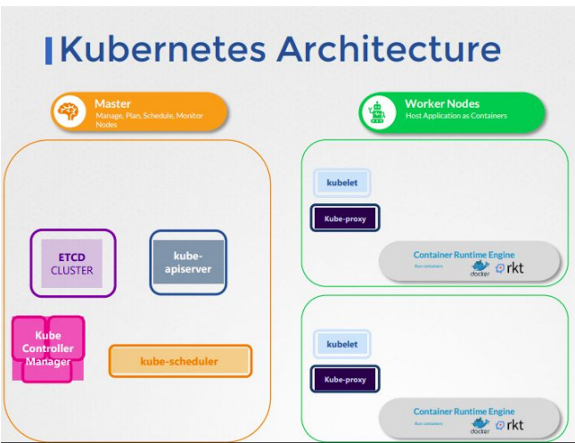
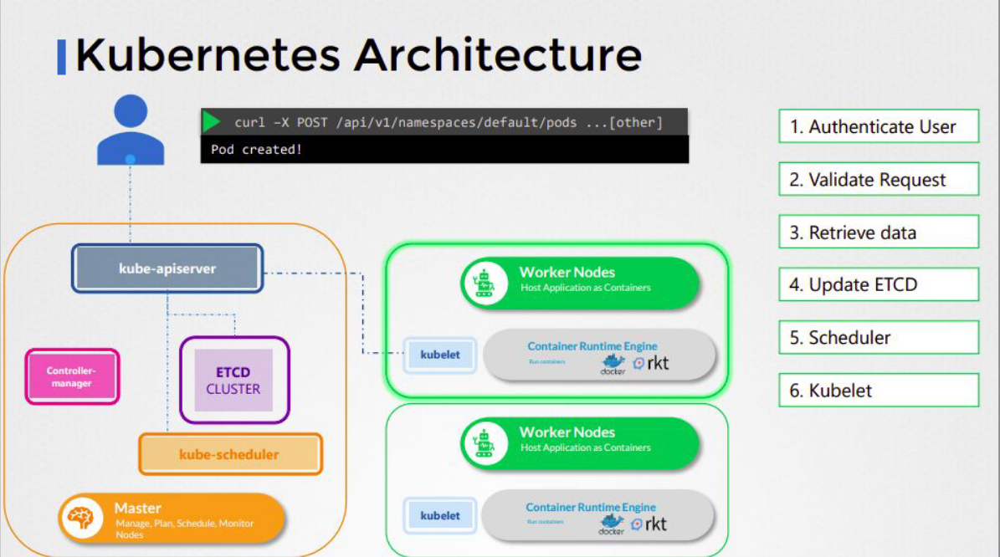
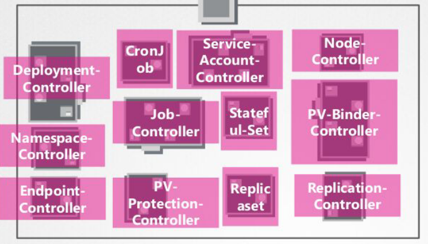

# 🎃 Kubernetes
### 📖Kubernetes Architecture:
We have a master node and worker nodes. The master node has the following components:
- **Kube-api-server** : It's the endpoint of the cluster, the place where all the requests are sent to. The API server Communicates with the Kubelet on the worker nodes and then the Kubelet executes the request.
- **ETCD** : Stores all the data about the cluster
- **Kube-scheduler**  : Decides which pod(Container) should be run on which node based on the recources 
- **Kube-controller-manager** : It contains multiple controllers that are responsible for the different parts of the cluster.

The Worker node has the following components:
- **Kubelet** : Is the Pilot of the worker node can start and stop and control , it communicates with the master through the api-server, It provides the api-server with the node status and the pod status.
- **Container runtime** : like Docker

### 📖The Communication Inside the Cluster: 
The Api-server is responsible almost for all the requests and connections, It reachs the **ETCD** & **Scheduler** & **Controller-manager** and the **Kubelet** on the worker nodes. The Kubelet communicates with the container runtime to start and stop the containers.

### 📖Kube-controller-manager:
It contains multiple controllers that are responsible for the different parts of the cluster. The controllers are:

We Will Talk about the Node-controller , The

