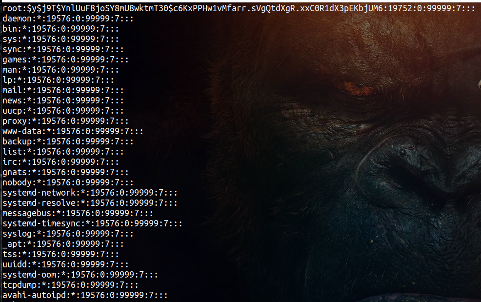

# Red Hat Administration    
### User and Group Management
**The file `passwd` in the path `/etc/passwd` contains the following :**


They all follow the same format :

> loginame : x : uid : gid : comment : home-directory : login-shell

Included fields are:
 - Login name
 - User Id (uid)
 - Group Id (gid)
 - Comment about the user
 - Home Directory
 - Login shell

---

**The file `shadow` in the path `/etc/shadow` contains the following :**



They all follow the same format :

> username: encrypted_passwd :last_changed : min:max: warn: inactive : expire : future-use
 
---


**Adding a new user**

```bash
useradd username
```

Change the passowrd of a user

```bash
passwd username
```

**To change a user's account information**
```bash
usermod
```
> Read the following link for more information : [usermod](https://www.geeksforgeeks.org/usermod-command-in-linux-with-examples/)

with the following options:
- `-c` : Comment   ->         ```usermod -c "This a description for the user " test_user```
- `-d` : Home directory  ->   ```usermod -d /home/manav test_user```
- `-e` : Expiry date     ->   ```usermod -e 2020-12-31 test_user```
- `-g` : Group              ->   ```usermod -g groupname test_user```
- `-G` : Additional groups ->  ```usermod -G groupname test_user```
- `-l` : Login name     ->  ```usermod -l newname test_user```
- `-L` : Lock account       ->  ```usermod -L test_user```
- `-m` : Move home directory content -> ```usermod -m -d /home/test_user test_user```
- `-p` : Password         ->  ```usermod -p password test_user```

---

**Password aging**
-  ```bash
    chage [options] username
   ```

• Options
• -m: to change the min number of days between password changes
• -M: to change the max number of days between password changes
• -E date: change the expiration date for the account
• -W: change the number of days to start warning before a password
change will be required


---
**Managing Groups**

- Creating New Group
```bash
groupadd groupname
```
- Modifying an Existing Group
```bash
groupmod [options] groupname
```
- Deleting a Certain Group
```bash
groupdel groupname
```
- List all file which are owned by groups not defined in
/etc/group file
```bash
find / -nogroup
```