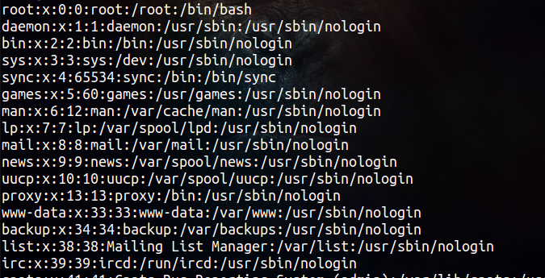

# Red Hat Administration    
### User and Group Management
The file `passwd` in the path `/etc/passwd` contains the following :

They all follow the same format :

> loginame:x:uid:gid:comment:home-directory:login-shell

Included fields are:
 - Login name
 - User Id (uid)
 - Group Id (gid)
 - Comment about the user
 - Home Directory
 - Login shell

 

